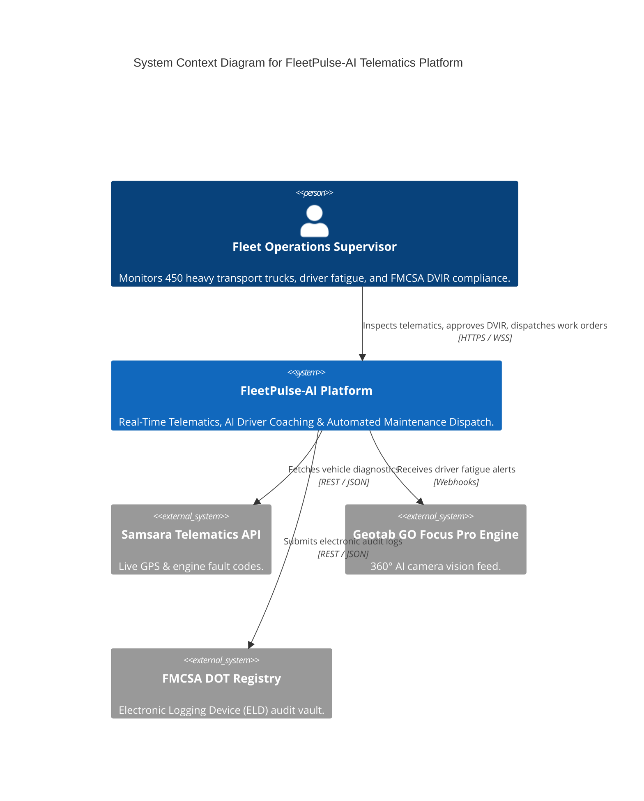
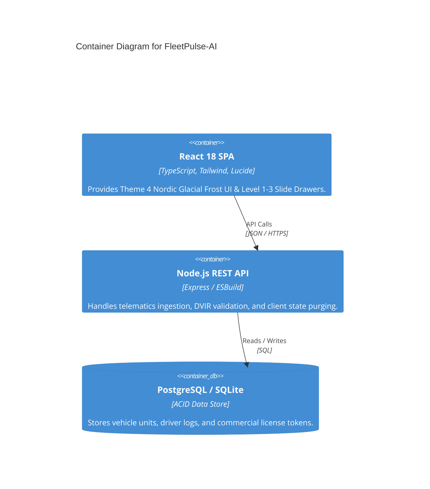

# 🏛️ FleetPulse-AI C4 Architecture Diagrams

## Level 1: System Context Diagram

```mermaid
C4Context
    title System Context Diagram for FleetPulse-AI Telematics Platform

    Person(fleetManager, "Fleet Operations Supervisor", "Monitors 450 heavy transport trucks, driver fatigue, and FMCSA DVIR compliance.")
    System(fleetPulse, "FleetPulse-AI Platform", "Real-Time Telematics, AI Driver Coaching & Automated Maintenance Dispatch.")
    System_Ext(samsara, "Samsara Telematics API", "Live GPS & engine fault codes.")
    System_Ext(geotab, "Geotab GO Focus Pro Engine", "360° AI camera vision feed.")
    System_Ext(fmcsa, "FMCSA DOT Registry", "Electronic Logging Device (ELD) audit vault.")

    Rel(fleetManager, fleetPulse, "Inspects telematics, approves DVIR, dispatches work orders", "HTTPS / WSS")
    Rel(fleetPulse, samsara, "Fetches vehicle diagnostics", "REST / JSON")
    Rel(fleetPulse, geotab, "Receives driver fatigue alerts", "Webhooks")
    Rel(fleetPulse, fmcsa, "Submits electronic audit logs", "REST / JSON")
```

## Level 2: Container Diagram

```mermaid
C4Container
    title Container Diagram for FleetPulse-AI

    Container(webApp, "React 18 SPA", "TypeScript, Tailwind, Lucide", "Provides Theme 4 Nordic Glacial Frost UI & Level 1-3 Slide Drawers.")
    Container(apiGateway, "Node.js REST API", "Express / ESBuild", "Handles telematics ingestion, DVIR validation, and client state purging.")
    ContainerDb(database, "PostgreSQL / SQLite", "ACID Data Store", "Stores vehicle units, driver logs, and commercial license tokens.")

    Rel(webApp, apiGateway, "API Calls", "JSON / HTTPS")
    Rel(apiGateway, database, "Reads / Writes", "SQL")
```
