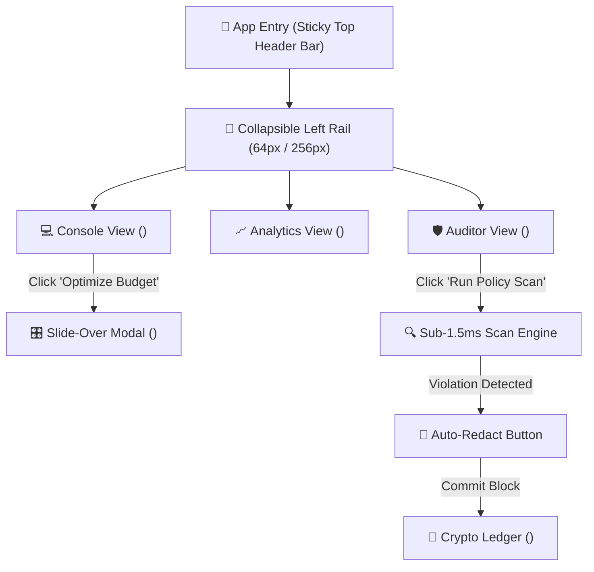

# Research Task 4: Journeys, Application States & UI Views Mapping

> 📍 **WORKFLOW TELEMETRY**: `[STAGE 11 DEEP RESEARCH: JOURNEYS, STATES & VIEWS — 🟢 COMPLETED]`  
> **Client**: **Reddit Inc.** (Ad Engineering & ML Infrastructure Division)  

---

## 🧭 1. End-to-End User Journey Mapping

---

## 🔄 2. Application State Specifications

1. **`IDLE`**: Initial state; top telemetry header ticker active, left rail collapsed (64px).
2. **`LIVE_STREAMING`**: High-throughput auction stream processing 1.5M bids/sec; table updating at 60fps.
3. **`DRAWER_OPEN`**: Budget optimizer slide-over right drawer active; background scroll locked.
4. **`SCANNING`**: Ad policy auditor running regex scan (1.42ms processing time).
5. **`VIOLATION_DETECTED`**: Glowing rose alert banner active highlighting exposed AWS/OAuth secrets.
6. **`REDACTED_COMMITTED`**: Text sanitized to `[REDACTED_AWS_ACCESS_KEY]` and SHA-256 block added to ledger.
