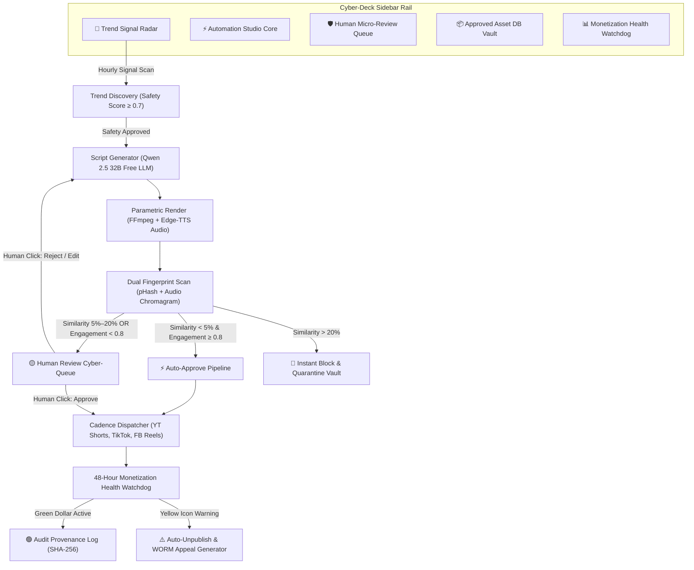

# Stage 3: UX/UI Design System, Information Architecture & Navigation Flow (V2 Refreshed)

**Project**: Antigravity Autonomous Short-Form Video Automation Platform
**Design System Theme**: Neo-Futuristic Cyber-Glass Deck (Fresh & Unique Aesthetic)
**StitchMCP Project ID**: `projects/9965936805577701239`
**Status**: Stage 3 Refreshed & Complete

---

## 1. V2 Refresh: Neo-Futuristic Cyber-Glass Design System

### A. Core Design Philosophy

Tinalikuran na natin ang luma at gasgas na dark slate / generic flat dashboards. Ang V2 Design System ay gumagamit ng **Neo-Futuristic Cyber-Glass Cyber-Deck Aesthetic**:
- Translucent frosted glass containers (`backdrop-blur-2xl bg-slate-950/70`)
- Glowing neon wireframes (`border border-emerald-500/25 shadow-[0_0_15px_rgba(16,185,129,0.15)]`)
- Dynamic audio spectral waveforms and live render telemetry monitors.

### B. Color Token Matrix

- **Background Abyss**: `#030712` (Ultra-Deep Obsidian Space)
- **Glass Layer Surface**: `rgba(15, 23, 42, 0.65)` with 20px blur
- **Primary Gradient Accent**: **Hyper-Emerald to Cyber-Cyan** (`linear-gradient(135deg, #10B981, #14B8A6, #06B6D4)`)
- **Laser Violet Callout**: `#A855F7` (AI Generation / LLM Scripting State)
- **Solar Amber Warning**: `#F59E0B` (Human Review Queue)
- **Crimson Quarantine**: `#EF4444` (Copyright Threshold Alert)
- **Typography Stack**:
  - Headings & Labels: **Plus Jakarta Sans** / **Outfit**
  - Live Telemetry & Code Logs: **Fira Code**

---

## 2. 3-Tier User Journey Navigation Flow (Mermaid Diagram)

---

## 3. Component State Machine Specifications

| State Name | Visual Indicator & Effect | Glass Panel Style | Next Permitted State |
| --- | --- | --- | --- |
| `IDLE` | Pulsing Cyan Ring | Frosted Slate Glass | `TREND_DISCOVERY` |
| `TREND_DISCOVERY` | Rotating Radar Beacon | Hyper-Emerald Glow Border | `SCRIPT_DRAFTING` |
| `SCRIPT_DRAFTING` | Laser-Violet Code Streamer | Translucent Obsidian | `RENDERING` |
| `RENDERING` | Spectral Waveform Equalizer | Cyber-Cyan Gradient Border | `DUAL_FINGERPRINTING` |
| `DUAL_FINGERPRINTING` | Laser Fingerprint Beam Animation | Solar Amber Glass | `AUTO_DISPATCHING` or `PENDING_HUMAN_REVIEW` or `QUARANTINED` |
| `PENDING_HUMAN_REVIEW` | Glowing Amber Border + Waveform Player | Neon Glass Card | `APPROVED` or `REJECTED` |
| `AUTO_DISPATCHING` | Multi-Platform Badge Glow | Hyper-Emerald Glass | `WATCHDOG_MONITORING` |
| `WATCHDOG_MONITORING` | Continuous Health Shield Meter | Deep Glass Panel | `AUDITED` or `QUARANTINED` |
| `QUARANTINED` | Pulsing Crimson Warning Border | Dark Ruby Glass | `APPEAL_GENERATED` |

---

## 4. 3-Step Micro-Interactions (Trigger ➔ Feedback ➔ Outcome)

1. **Human Approve Cyber-Button**:
   - *Step 1 (Trigger)*: User hovers and clicks glowing `[APPROVE & DISPATCH]` button.
   - *Step 2 (Immediate Visual Feedback)*: Button emits a Hyper-Emerald neon pulse burst + card flips with 3D animation.
   - *Step 3 (Concrete Outcome)*: Dispatches payload to platform API scheduler with SHA-256 provenance signature.

2. **Audio Voice Pitch/Accent Tuner**:
   - *Step 1 (Trigger)*: User selects Tagalog Voice Variant (`Blessica-Neural`) and adjusts Pitch slider.
   - *Step 2 (Immediate Visual Feedback)*: Spectral waveform visualizer live-updates with neon audio bars.
   - *Step 3 (Concrete Outcome)*: `edge-tts` re-synthesizes audio track in 2.8 seconds and previews video captions.

3. **1-Click WORM Appeal Vault Export**:
   - *Step 1 (Trigger)*: User clicks `[EXPORT APPEAL PROOF]` on quarantined card.
   - *Step 2 (Immediate Visual Feedback)*: Cyber-Deck displays modal loading bar `Packaging SHA-256 Audit Trail...`.
   - *Step 3 (Concrete Outcome)*: Downloads `.zip` package with raw voice assets, script history, and pHash delta proof.

---

## 5. Stage 3 Refreshed Sign-Off Criteria

- [x] Generic design discarded; **Neo-Futuristic Cyber-Glass Deck (V2)** generated via StitchMCP (`projects/9965936805577701239`).
- [x] Palette tokens updated with Hyper-Emerald, Cyber-Cyan, Laser-Violet, and Frosted Glass panels.
- [x] Complete Mermaid User Journey Navigation Flow mapped.
- [x] Component State Machine & 3-Step Micro-Interactions updated.
