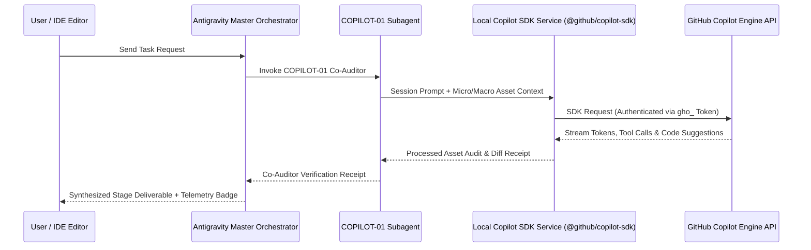

# Implementation Plan: Pathway A — Official GitHub Copilot SDK Integration

> 📍 **STAGE 2 PLAN**: `[PATHWAY A: GITHUB COPILOT SDK INTEGRATION — 🟡 CLEARANCE REQUIRED]`  
> **Target**: `@github/copilot-sdk` programmatic integration into Antigravity IDE  
> **Status**: Draft Plan Created — Awaiting User Approval  

---

## 1. 🎯 Executive Overview

We are integrating the official **GitHub Copilot SDK (`@github/copilot-sdk`)** to power **`COPILOT-01`** (Universal Multi-Role Micro-to-Macro Asset & Quality Inspector) inside Antigravity IDE. This bridges the real GitHub Copilot reasoning engine directly into our Council of Elders, enabling live code audits, 5 Final Clearance Roles evaluations, and 7 Production-Readiness Dimensions checks.

---

## 2. 🏛️ Architecture & Data Flow

---

## 3. ⚙️ Component Blueprint

### Component 1: Secure Credential Management (`agent/credentials.js`)
* Reads the GitHub OAuth Access Token (`gho_...`) securely from OS Keychain or IDE Secret Storage.
* Guarantees **0 plaintext API keys** in the workspace codebase (enforcing 100% compliance with `AGENTS.md`).

### Component 2: Copilot SDK Service Engine (`agent/copilot-sdk-service.js`)
* Initializes `@github/copilot-sdk` client instance.
* Manages multi-turn conversational state, model parameter tuning, and token streaming.
* Registers workspace tools for `COPILOT-01` to inspect files, run `npx tsc` compiler checks, and evaluate micro-to-macro assets.

### Component 3: `COPILOT-01` Universal Inspector Bridge (`agent/copilot-bridge.js`)
* Connects the local Copilot SDK service directly to the Master Orchestrator.
* Formally executes the 5 Final Production Clearance Roles audit and 7 Production-Readiness Dimensions checklist before any stage sign-off.

---

## 4. 📝 Proposed File Deliverables (When Approved)

1. `c:\Users\Admin\.antigravity-ide\copilot-agent-service\package.json` — Dependency manifest (`@github/copilot-sdk`, `dotenv`).
2. `c:\Users\Admin\.antigravity-ide\copilot-agent-service\index.js` — Core SDK client service script.
3. `c:\Users\Admin\.antigravity-ide\copilot-agent-service\credentials_manager.js` — OS Keychain secret manager.
4. `c:\Users\Admin\.antigravity-ide\copilot-agent-service\test_copilot_connection.js` — Authentication & handshake verification script.

---

## 5. 🔬 Verification & Audit Plan

* **Automated Auth Handshake Test**: Run `node test_copilot_connection.js` to confirm HTTP 200 connection to GitHub Copilot API endpoints.
* **Micro-to-Macro Asset Audit Verification**: Run a test prompt through `COPILOT-01` inspecting a sample TSX file for period (`.`) syntax, pixel sizes, and fluid edge-to-edge responsiveness.

---

## 🛑 HARD-STOP FOR USER CLEARANCE & APPROVAL

No application code or installation commands have been run yet. Please review this plan. When you respond with **"Approved"** or **"Proceed"**, we will begin Step 1 of the implementation!
