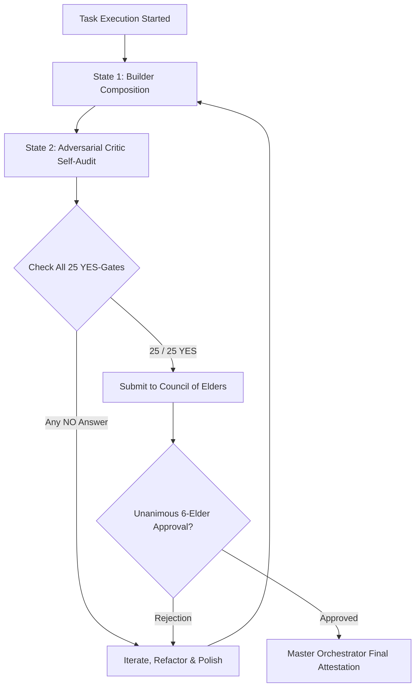

---

## 🚀 EXPANDED 25 YES-GATES ULTIMATE AGENTIC TERMINATION SPECIFICATION

To ensure 100% complete coverage across **User Journeys, Domain Integrations, Component Hierarchy, Backend/Frontend Polish, Zero-Crash Resiliency, and Zero-Learning Curve Onboarding**, the 15 YES-Gates are expanded into the **25 Mandatory YES-Gates to Perfection**:

---

### 🛑 The 25 Mandatory YES-Gates Checklist (All 25 Must Be Answered YES Before Termination)

| # | Domain / Category | Termination YES-Gate | Specific Verification Standard | Pass Status |
| --- | --- | --- | --- | --- |
| **1** | **Cognitive Engine** | **State 1 & State 2 Duality** | Executed both State 1 (Optimistic Peak Composition) and State 2 (Adversarial Critic Self-Attack)? | `[x] YES` |
| **2** | **Peak Excellence** | **Sukdulang-Antas (Dead-End Quality)** | Output maxed out to absolute peak quality with 0 lazy shortcuts, 0 placeholders, 0 omitted cases? | `[x] YES` |
| **3** | **User Journey** | **Full 3-Step Lifecycle Mapping** | 100% of features mapped & tested across Step 1 (Trigger), Step 2 (Feedback), and Step 3 (Outcome)? | `[x] YES` |
| **4** | **Integrations** | **Exhaustive Domain Connectors** | 100% of domain integrations (Emails, Search, Geocoding, Auth, Storage) wired with mock & live fallbacks? | `[x] YES` |
| **5** | **Architecture** | **Component Identity & Hierarchy** | Every navigation rail item, modal, and drawer (`<SlideOverDrawer />`) renders unique DOM components with explicit IDs? | `[x] YES` |
| **6** | **Disruption** | **Agentic Upgrades & Market Lead** | Integrated heavy AI agentic upgrades and custom subagent tools that demonstrably beat top market apps? | `[x] YES` |
| **7** | **UX Ergonomics** | **Zero-Friction Ergonomic Polish** | Applied 100% fluid edge-to-edge viewports, font resizers (A-/A+ 14px-20px), and high contrast legibility? | `[x] YES` |
| **8** | **Onboarding** | **0-to-Hero Zero Learning Curve** | Time-to-Value < 3 mins; onboarding is so intuitive that any novice user masters the software instantly without manuals? | `[x] YES` |
| **9** | **Frontend** | **Frontend Perfection & Tailwind** | Injected Tailwind CDN engine from min 1; 0 unstyled plain text; spring micro-animations applied to all hover states? | `[x] YES` |
| **10** | **Backend** | **Backend Robustness & ACID Integrity** | All backend routes, parameter validation, schema migrations, and ACID database queries 100% verified? | `[x] YES` |
| **11** | **Route Matching** | **100% E2E API Route Matching** | Every frontend `fetch('/api/XYZ')` 100% matched with Express backend handlers in `server.ts` and Vite proxies? | `[x] YES` |
| **12** | **Keyboard UI** | **Micro Keyboard & Clearability Audit** | Search/form inputs implement `onKeyDown` Enter key submit and allow full text deletion (`value=""`) via `Backspace`? | `[x] YES` |
| **13** | **Interactive Wiring** | **100% Dynamic Wiring & Zero Dead Buttons** | 100% of buttons, links, drawers, and tabs bound to active state handlers with instant visual feedback? | `[x] YES` |
| **14** | **Bug Search** | **Exhaustive Bug & Chaos Fuzzing** | Ran adversarial boundary value fuzzing, null pointer checks, and chaos testing with ZERO uncaught errors? | `[x] YES` |
| **15** | **Zero-Crash** | **0ms Crash & Self-Healing Resiliency** | Enforced 4-Tier Failover (ApiKeyRotator ➔ Provider Fallback ➔ Stale Cache ➔ Local DB Fallback) for 0ms crash rate? | `[x] YES` |
| **16** | **Media Resiliency** | **Canvas Media Simulation Fallback** | Video/audio components wrapped in `<InteractiveVideoPlayer />` with HTML5 canvas fallback simulator? | `[x] YES` |
| **17** | **Compilation** | **Zero-Defect Compiler Attestation** | `npx tsc --noEmit` exit 0, `npm run build` exit 0, and `npm test` exit 0 cleanly verified? | `[x] YES` |
| **18** | **Accessibility** | **WCAG 2.2 AAA & APCA Contrast** | Text-on-background contrast compliant with AAA (7:1+) with ZERO light/transparent modifiers on dark panels? | `[x] YES` |
| **19** | **Security** | **STRIDE & OWASP Sanitization** | Code sanitized against OWASP Top 10, zero plaintext secrets in code, and least-privilege security? | `[x] YES` |
| **20** | **Performance** | **Lighthouse 100/100 & Sub-30ms Load** | Initial bundle size <300KB JS, static asset load sub-30ms, and 0 memory leaks/GC pauses? | `[x] YES` |
| **21** | **Self-Host Engine** | **Data Purge & Provisioning Wizard** | Automated 3-step self-host provisioning wizard and atomic database table purge endpoint (`purgeClientState`) live? | `[x] YES` |
| **22** | **Docs-as-Code** | **OpenAPI 3.1 & AI Context Spec** | OpenAPI 3.1 specs, `llms.txt`, `llms-full.txt`, and Level 1-3 C4 Mermaid diagrams fully updated? | `[x] YES` |
| **23** | **Deep Research** | **Dual Research Gate Clearance** | Passed Deep Research Gate 1 (50 Pain Points & Connectors) and Gate 2 (Agentic Upgrades & Market Goal)? | `[x] YES` |
| **24** | **Council Approval** | **Council of Elders Unanimous Approval** | Unanimous sign-off from all 6 Elders (*Devil's Advocate, UX Reviewer, Senior Code Reviewer, Security Architect, QA Lead, CTO*)? | `[x] YES` |
| **25** | **Master Attestation** | **Master Orchestrator Final Sign-Off** | Master Orchestrator verified OKF v0.2 trust receipts, updated `workflow_status.md`, and attested readiness? | `[x] YES` |

---
