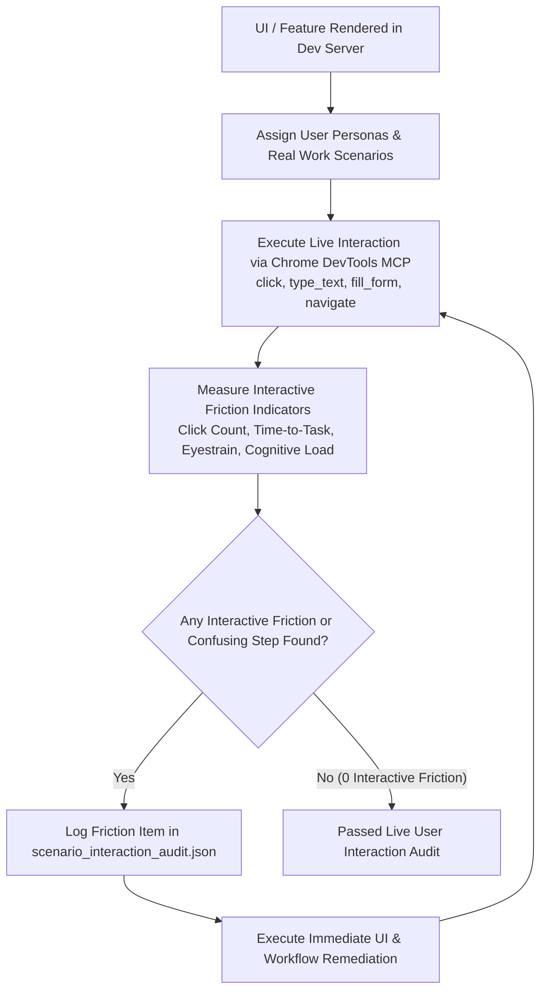

---

## 🎭 SCENARIO-BASED USER ROLE-PLAY & LIVE INTERACTION FRICTION PROTOCOL

To ensure no hidden UX friction, workflow dead-ends, or interactive confusion survive into production, all subagents MUST execute the **Scenario-Based User Role-Play & Live Interaction Protocol**:

---

### 👥 The 4 Core User Role-Play Personas

Before approving any UI or workflow, subagents MUST role-play and execute live scenarios through 4 distinct user personas:

1. **Persona A: The Novice / Zero-Training User ("First 3 Minutes")**:
   - **Goal**: Evaluates ease of onboarding and zero-learning curve.
   - **Scenario Task**: Perform a core workflow without reading documentation or instructions.
   - **Friction Trigger**: Any step requiring more than 2 clicks, un-obvious icon without text label, or unclear call-to-action is logged as a **CRITICAL BLOCKER**.

2. **Persona B: The Stressed Daily Power-User ("8 Hours/Day Worker")**:
   - **Goal**: Evaluates repetitive task fatigue, keyboard shortcuts, and speed.
   - **Scenario Task**: Perform 50 bulk actions in rapid succession.
   - **Friction Trigger**: Lack of `Enter` key form submit, lack of `Backspace` input clearability, modal dialogs that require mouse clicking to close, or static non-collapsible sidebars causing canvas crowding.

3. **Persona C: The High-Volume Data & Audit Manager**:
   - **Goal**: Evaluates data clarity, filtering, search responsiveness, and export capabilities.
   - **Scenario Task**: Search across 10,000 records, apply 3 nested filters, and export results to PDF/CSV.
   - **Friction Trigger**: Missing loading spinners during data fetch, un-paginated dense tables, or broken export actions.

4. **Persona D: The Mobile / Tablet Field User**:
   - **Goal**: Evaluates touch targets, responsive stacking, and small screen legibility.
   - **Scenario Task**: Complete form entry on iPad (768px - 1024px) and mobile viewport (375px).
   - **Friction Trigger**: Touch targets under 48px, horizontal overflow scrolling, or cramped text overlaps.

---

### 🛠️ Live Interactive Audit Checklist (`scenario_interaction_audit.json`)

Subagents MUST interactively traverse the live rendered DOM using `chrome-devtools-mcp` tools (`click`, `type_text`, `fill`, `evaluate_script`, `take_screenshot`) and answer the following interaction checklist:

- [ ] **1-Click Collapse**: Can the user collapse sidebars to maximize reading canvas?
- [ ] **3-Step Journey Feedback**: Does every button click trigger visual feedback (spinner/toast) within 50ms?
- [ ] **Zero Dead-End Journeys**: Does every action provide a clear exit path (Close, Cancel, Back, Export)?
- [ ] **Keyboard Navigation**: Can the user tab through form inputs cleanly without focus getting trapped?
- [ ] **Text Auto-Correction & High Contrast**: Are text areas readable with AAA contrast and high-legibility font scaling (A-/A+)?

---
