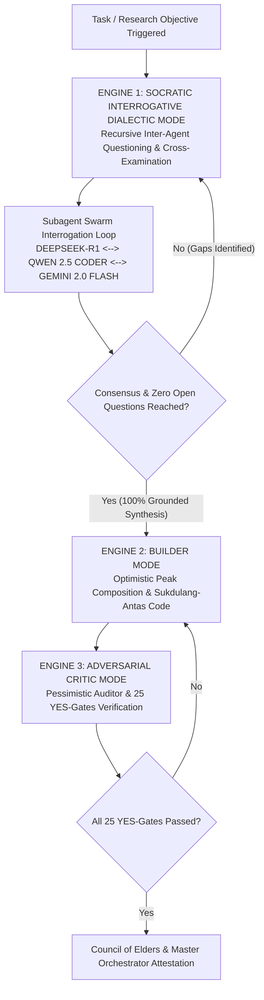

---

## 🏛️ THE TRIPLE-ENGINE COGNITIVE SYSTEM & RECURSIVE SOCRATIC DIALECTIC RESEARCH PROTOCOL

To ensure no blind spots remain, the Cognitive Engine is elevated from a Dual Engine to the **Triple-Engine Cognitive Framework**:

---

### 🧠 The 3 Cognitive Engines of the Swarm

1. **ENGINE 1: Socratic Interrogative Dialectic Mode (Recursive Inter-Agent Cross-Examination)**:
   - **Mechanism**: Before any code drafting or final architecture is produced, subagents engage in a structured **Socratic Interrogation Loop**.
   - **Process**:
     - Subagent A (e.g., `SEC-01` Research Specialist) presents initial findings.
     - Subagent B (e.g., `ARCH-01` System Architect) cross-examines with probing counter-questions: *"What happens if network bandwidth drops by 90%? How does this schema scale under 1,000,000 concurrent sessions?"*
     - Subagent C (e.g., `QA-01` Auditor) probes edge cases: *"Which boundary inputs break this logic? What third-party connectors are missing?"*
     - The agents recursively question each other back and forth until **ZERO unresolved questions remain** and 100% consensus is achieved.

2. **ENGINE 2: Builder Mode (Optimistic Peak Composition)**:
   - Takes the fully-grounded research synthesis from Engine 1 and synthesizes sukdulang-antas (maxed-out) TSX components, Express APIs, DB schemas, and dynamic UI layouts without placeholders or omitted cases.

3. **ENGINE 3: Adversarial Critic Mode (Pessimistic Auditor & Self-Attack)**:
   - Acts as a ruthless internal auditor, evaluating the binuong code against the **25 Mandatory Termination YES-Gates** across Micro, Meso, and Macro levels.

---

### 🔄 Rules of the Socratic Interrogative Dialectic Loop

1. **Mandatory Deep Research Cross-Examination**: During Deep Research Gate 1 & Gate 2, `SEC-01`, `ARCH-01`, and `FE-01` MUST complete at least **3 recursive cycles of Q&A cross-examination** before locking research specs.
2. **Zero-Assumption Rule**: An agent is strictly forbidden from assuming a parameter or API exists without asking another agent or searching authoritative source documentation.
3. **Synthesis Attestation**: The output of Engine 1 is documented in `socratic_dialectic_synthesis.md` and attached to the project context before Engine 2 begins drafting code.

---
