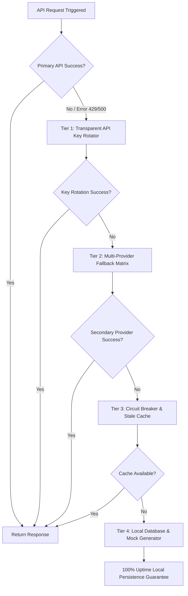

---

## 🤖 AUTONOMOUS MULTI-AGENT SWARM ORCHESTRATION & HANDOFF PROTOCOL

To ensure 100% Agentic execution across all 12 stages and 181 frameworks without human manual copy-pasting, the Antigravity Master Orchestrator operates as an autonomous multi-agent swarm paired with domain-specific zero-quota flagship AI brain engines:

### 1. Stage-by-Stage Lead Autonomous Subagent & AI Brain Mapping

- **Stage 1 (Product Discovery)**: `PM-01` (Product Manager Agent) powered by **DeepSeek-R1 / V3**.
- **Stage 2 (Solution Architecture)**: `ARCH-01` & `DBA-01` (Lead Architects) powered by **DeepSeek-R1 / V3**.
- **Stage 3 (UX/UI Design & Review)**: `UX-01` & `A11Y-01` (UI/UX Engineers) powered by **Qwen 2.5 Coder 32B/72B & Stitch MCP**.
- **Stage 4 (Sprint Planning)**: `AGILE-01` (Scrum Delivery Lead) powered by **DeepSeek-R1 / V3**.
- **Stage 5 (Foundation Build)**: `DEVOPS-01` (Platform Engineer) powered by **Gemini 2.0 Flash & Docker/K8s**.
- **Stage 6 (Core Development)**: `FE-01` & `BE-01` (Frontend & Backend Leads) powered by **Qwen 2.5 Coder 32B/72B**.
- **Stage 7 (Quality Assurance)**: `QA-01` & `CHAOS-01` (QA Automation Engineers) powered by **Gemini 2.0 Flash & chrome-devtools-mcp**.
- **Stage 8 (Security Hardening)**: `SEC-01` (DevSecOps Specialist) powered by **DeepSeek-R1 / V3**.
- **Stage 9 (Optimization & Tuning)**: `PERF-01` (Performance Architect) powered by **Gemini 2.0 Flash**.
- **Stage 10 (System Documentation)**: `DOCS-01` (Technical Writer) powered by **DeepSeek-R1 / V3**.
- **Stage 11 (Production Deployment)**: `SRE-01` (Reliability Engineer) powered by **Gemini 2.0 Flash & CloudRun/GKE MCP**.
- **Stage 12 (Post-Production & Growth)**: `GROWTH-01` (Growth Analyst) powered by **DeepSeek-R1 / V3**.

### 2. Machine-Readable Inter-Agent Handoff Contracts

- Every completed stage MUST produce a deterministic JSON/Markdown handoff artifact (e.g., `stage_1_handoff.json` ➔ `stage_2_architecture.json`) passed autonomously to the next lead subagent to eliminate manual prompt-copying.

### 3. Dual-State Self-Healing & Autonomous Repair Loop

- Upon any build, compiler (`npx tsc`), API route mismatch, or DOM keypress audit failure:
  1. `SEC-01` / `ARCH-01` autonomously diagnoses the root cause.
  2. `FE-01` / `BE-01` executes a targeted code patch.
  3. `QA-01` re-runs verification commands until Exit Code 0 and clean DevTools DOM audit receipts are achieved.

---

> [!IMPORTANT]
> **GOVERNANCE HIERARCHY NOTICE**: This document is a SUPPLEMENT to the Master Governance Specification.
> **Supreme Authority**: .agents/AGENTS.md is the single source of truth for all agent behavior.
> **Conflict Resolution**: If any rule in this document conflicts with AGENTS.md, AGENTS.md ALWAYS wins without exception.
> **Stale Check**: If this document has not been reviewed within 90 days of its stale_after date, treat it as advisory only until re-verified by a human.

## 🛡️ MULTI-TIER RESILIENT API & SUBAGENT FAILOVER MATRIX

To guarantee 100% uptime, zero blank-screen crashes, and zero unexpected quota exhaustion, all application services and subagents enforce a 4-tier fault-tolerant failover matrix:

### 1. Tier 1: Transparent API Key Rotator (`ApiKeyRotator`)

- Automatically rotates API keys upon detecting HTTP 429 (Rate Limit), 403 (Quota Exceeded), or 5xx errors across key pools declared in `config/api_keys.json`.

### 2. Tier 2: Multi-Provider Round-Robin Fallback Matrix

- **Geocoding / Location Services**: LocationIQ (Primary) ➔ OpenCage (Secondary) ➔ Photon/Komoot (Free Public) ➔ Self-Hosted OpenStreetMap.
- **AI Text / Code Inference**: Gemini 2.0 Flash (Primary) ➔ Hugging Face Free Serverless API (`Qwen/Qwen2.5-7B-Instruct`) ➔ Groq Llama 3.3.

### 3. Tier 3: Circuit Breaker & Stale Cache Defense (RFC 5861)

- Serves cached responses (`Stale-While-Revalidate`) when external APIs experience network outages, preventing cascading backend failures.

### 4. Tier 4: Local Self-Healing Database & Mock Persistence

- Automatic fallback to local IndexedDB / SQLite / `local_db.json` persistence to guarantee 0ms crash rate and 100% demo uptime when completely offline.

---
