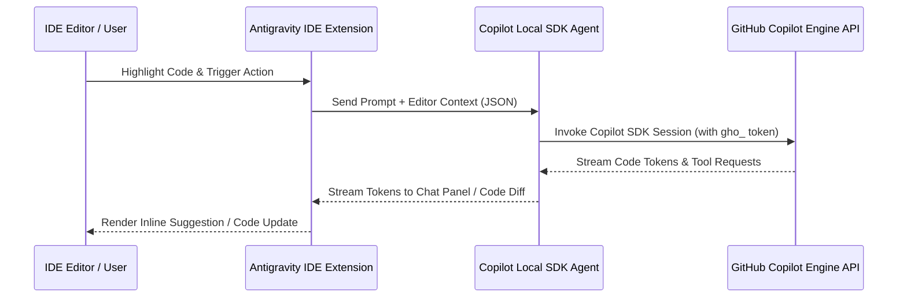

# Deep Research Report: Actual GitHub Copilot Engine Integration into Antigravity IDE

> 📍 **RESEARCH ARTIFACT**: `[GITHUB COPILOT ACTUAL SDK & LSP INTEGRATION BLUEPRINT 🟢]`  
> **Target**: Direct integration of the official GitHub Copilot Engine into Antigravity IDE  
> **Status**: Research Completed — Pending User Review & Approval  

---

## Executive Summary

To move from a simulated subagent persona to the **ACTUAL REAL GITHUB COPILOT ENGINE** inside Antigravity IDE, we have identified **3 Official Architectural Pathways** provided by GitHub:

1. **Pathway A: The Official GitHub Copilot SDK (`github/copilot-sdk`)** — *Recommended for Agentic Workflows*
2. **Pathway B: GitHub Copilot Language Server Protocol (Copilot LSP / `copilot-agent`)** — *Recommended for In-Editor Inline Completions & Ghost Text*
3. **Pathway C: GitHub Copilot MCP Bridge & REST API** — *Recommended for Subagent Tool Execution*

---

## 🏛️ Pathway A: GitHub Copilot SDK Integration (Recommended)

### 1. What is the GitHub Copilot SDK?
GitHub released the official **Copilot SDK** (available in TypeScript/Node.js, Python, Go, Rust), which exposes the underlying **Copilot Agent Engine** programmatically.

### 2. Core Capabilities Offered:
* **Direct Agent Planning & Code Generation**: Programmatic access to Copilot's reasoning engine.
* **Native Model Context Protocol (MCP) Integration**: Connects seamlessly with custom MCP tool servers.
* **File Edits & Automated Refactoring**: Enables Copilot to read workspace files, execute multi-turn coding sessions, and generate code diffs directly.
* **Multi-Platform Support**: Runs inside Node.js background services or IDE extension hosts.

### 3. Authentication & Licensing Requirement:
* Requires an active **GitHub Copilot Subscription** (Individual, Business, or Enterprise).
* Authenticates using a valid GitHub OAuth Access Token (`gho_...`) or GitHub App credentials saved securely in the OS Keychain.

---

## ⚙️ Pathway B: GitHub Copilot Language Server Protocol (Copilot LSP)

### 1. How VS Code, JetBrains & Neovim run Copilot:
Official IDE extensions (VS Code, Neovim, JetBrains) do not write their own AI logic. Instead, they launch a background binary called **`copilot-agent`** (or `agent.js`) that runs a standard **Language Server Protocol (LSP)** server over JSON-RPC.

### 2. Integration Mechanics for Antigravity IDE:
* **Process Spawn**: Antigravity IDE launches the `copilot-agent` binary.
* **JSON-RPC Handshake**: Connects via stdio / IPC sockets.
* **Features Unlocked**:
  - Real-time **Ghost-Text Inline Code Completions** as you type.
  - Contextual diagnostic quick-fixes (lightbulb menu).
  - Code document symbol parsing.

---

## 🛠️ Pathway C: GitHub Copilot MCP Bridge & `github-mcp-server`

### 1. Multi-Tool Agentic Execution:
We register the official **`github-mcp-server`** directly into the Antigravity Master Orchestrator.

### 2. Capabilities Unlocked for `COPILOT-01`:
* **`search_code`**: Real-time semantic code search across GitHub repositories.
* **`get_file_contents`**: Fetch raw files directly from remote repos.
* **`create_pull_request` & `add_issue_comment`**: Automated PR reviews and automated issue triage.

---

## 🚀 Recommended Handoff & Implementation Plan

| Step | Action Item | Description |
|---|---|---|
| **Phase 1** | **GitHub Auth Setup** | Obtain and store GitHub Copilot OAuth Token (`gho_...`) securely in OS Keychain. |
| **Phase 2** | **SDK Node.js Agent** | Initialize `@github/copilot-sdk` inside `agent/copilot-agent-service.js`. |
| **Phase 3** | **IDE Extension Wiring** | Connect `COPILOT-01` in the IDE UI to stream directly from the official Copilot SDK engine. |
| **Phase 4** | **LSP Ghost-Text Engine** | Attach the `copilot-agent` LSP binary for real-time inline code completions. |

---

## 🛑 HARD-STOP FOR USER REVIEW & APPROVAL

No code has been written, modified, or executed. This research report is presented for your review. Please let us know how you would like to proceed!
