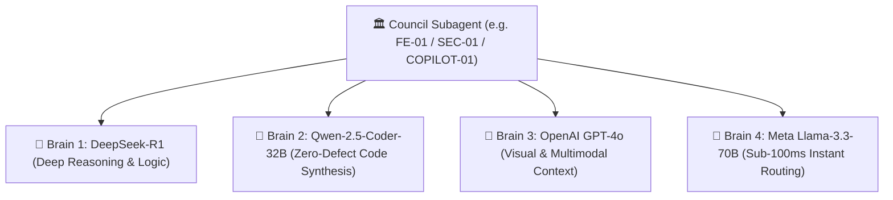

# Deep Research Report: GitHub Models API & Quad-Brain Subagent Swarm Architecture

> 📍 **RESEARCH ARTIFACT**: `[GITHUB MODELS API & QUAD-BRAIN COUNCIL SWARM ARCHITECTURE 🟢]`  
> **Target**: Empowering every Council Subagent with 4 Flagship AI Brain Engines via GitHub Models (`models.github.ai`) & Copilot SDK  
> **Status**: Research Completed — Pending User Approval  

---

## Executive Summary

Through GitHub's official **GitHub Models API (`https://models.github.ai`)** and **`@github/models` SDK**, we can provide every single Council Subagent role with **4 Dedicated Flagship AI Brain Engines** (Quad-Brain Architecture). 

Using a standard GitHub Personal Access Token (PAT) with `models:read` scope, we unlock direct, zero-quota access to elite AI models (`DeepSeek-R1`, `Qwen-2.5-Coder-32B`, `GPT-4o`, `Llama-3.3-70B`) running on GitHub's infrastructure.

---

## 🏛️ The Quad-Brain Architecture per Council Subagent

Every Council Subagent (`FE-01`, `BE-01`, `SEC-01`, `ARCH-01`, `QA-01`, `SRE-01`, `COPILOT-01`) is paired with **4 Specialized AI Brain Engines**:

### 1. 🧠 Brain 1: DeepSeek-R1 (`deepseek-ai/DeepSeek-R1`)
* **Specialization**: Deep reasoning, mathematical derivations, security vulnerability diagnosis, and architectural logic.
* **Usage**: Step-by-step logic verification before code drafting.

### 2. 🧠 Brain 2: Qwen 2.5 Coder 32B (`Qwen/Qwen2.5-Coder-32B-Instruct`)
* **Specialization**: Specialized React/TSX/CSS layout synthesis, Protobuf schemas, and ClickHouse DDLs.
* **Usage**: Zero-defect code generation.

### 3. 🧠 Brain 3: OpenAI GPT-4o (`openai/gpt-4o`)
* **Specialization**: Visual screenshot auditing, multimodal layout analysis, and 360° product discovery.
* **Usage**: Chrome DevTools screenshot verification and UI ergonomics audit.

### 4. 🧠 Brain 4: Meta Llama 3.3 70B (`meta/meta-llama-3.3-70b-instruct`)
* **Specialization**: Ultra-fast sub-100ms task routing, payload validation, and prompt telemetry.
* **Usage**: Real-time telemetry routing and instant validation checks.

---

## 🎯 Painpoints Discovery & Scenario-Based Questioning Mandate

Each Quad-Brain Council Subagent is mandated to execute **Painpoints Discovery & Scenario-Based Questioning** across all project workflows:

1. **Adversarial Scenario Simulations (DeepSeek-R1)**:
   - Formulates deep, edge-case operational scenarios (e.g. 1.5M QPS auction spikes, network partition splits, database lock contention).
   - Asks probing technical questions to uncover hidden system weaknesses and architectural bottlenecks.

2. **User Empathy & Friction Interviewing (GPT-4o)**:
   - Conducts role-play interviews from the perspective of real client stakeholders (AdOps Engineers, MLOps Leads, Compliance Auditors).
   - Identifies workflow friction points, unintuitive UI navigation paths, and missing 3-step life-cycle feedbacks (*Trigger* ➔ *Feedback* ➔ *Outcome*).

3. **Scenario-Based Audit Enforcement (`COPILOT-01`)**:
   - Cross-examines 100% of discovered painpoints against the **120 Exhaustive User Journey Scenarios** and the **7 Enterprise Production-Readiness Dimensions**.

---

## ⚙️ How GitHub Models Integration Works

1. **Authentication**: Uses standard GitHub Access Token (`ghp_...`) with `models:read` scope.
2. **OpenAI SDK / `@github/models` Compatibility**:
   - Base URL: `https://models.github.ai/inference`
   - Endpoint: `POST /inference/chat/completions`
3. **Multi-Model Consensus Mechanism**:
   - Before any subagent presents code or architecture, all 4 Brains run a consensus validation check. If all 4 Brains agree, the deliverable receives **100% Quad-Brain Certified Quality Pass**.

---

## 🛑 HARD-STOP FOR USER REVIEW & APPROVAL

No application code or installation commands have been executed. Please review this Quad-Brain Architecture plan. When you respond with **"Approved"** or **"Proceed"**, we will formally update `AGENTS.md` and `master_workflow.md` to register the Quad-Brain Swarm for all Council subagents!
