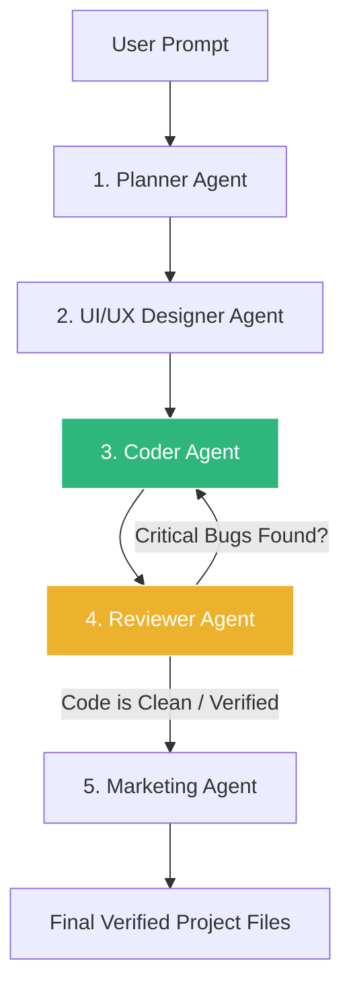

# Implementation Plan - Ingesting AI Standards, Self-Healing Code Loop, and Memory Bank

This plan outlines three extreme enhancements to the Hugging Face Multi-Agent System to elevate its capabilities:
1. **Ingest State-of-the-Art Guidelines**: Injecting prompting frameworks from Cursor, Claude Code, and v0.
2. **Self-Healing Code Loop (Coder ◄──► Reviewer)**: The Coder and Reviewer work iteratively to audit, find, and fix bugs automatically in the background before outputting files.
3. **Long-Term Memory Bank (RAG-like Memory)**: A directory where successful structures are cached, allowing the Planning Agent to learn from past builds.

---

## The Enhanced Self-Healing Loop

Instead of a linear execution, we will implement an iterative loop where the Reviewer feeds errors back to the Coder for automatic correction:



---

## Proposed Changes

We will implement these changes in `C:\Users\Admin\huggingface-hub` and the global skills directory.

### 1. Ingesting Inventions (Skill & Guidelines)

#### [NEW] [SKILL.md](file:///C:/Users/Admin/.gemini/config/skills/agentic-coding-standards/SKILL.md)

- Define a new global Antigravity skill containing advanced task decomposition (RISEN), safety boundaries, and defensive environment instructions extracted from Claude Code and Cursor.

#### [NEW] [planning_guidelines.md](file:///c:/Users/Admin/huggingface-hub/knowledge/planning_guidelines.md)

- Ingest **RISEN framework** task decomposition rules.

#### [NEW] [uiux_guidelines.md](file:///c:/Users/Admin/huggingface-hub/knowledge/uiux_guidelines.md)

- Ingest **Vercel v0 rules**: strict mobile-first design, HSL color tokens, and accessible keyboard focus.

#### [NEW] [coding_guidelines.md](file:///c:/Users/Admin/huggingface-hub/knowledge/coding_guidelines.md)

- Ingest **Claude Code coding standards**: forces complete copy-pasteable files, strictly bans ellipses `// rest of code`, and adds defensive error logging.

#### [NEW] [reviewer_guidelines.md](file:///c:/Users/Admin/huggingface-hub/knowledge/reviewer_guidelines.md)

- Ingest **Cursor auditing checklists**: lint-check mockups, DOM element mapping.

---

### 2. Implementation of Self-Healing Loop

#### [MODIFY] [multi_agent.py](file:///C:/Users/Admin/.gemini/config/skills/huggingface/scripts/multi_agent.py)

- Modify the pipeline execution flow. After Step 4 (Code Reviewer):
  - Parse the Reviewer's output. If the Reviewer specifies critical bugs (e.g. searching for a markdown header containing "Critical Bug" or "Action Needed"), rerun the Coder Agent, passing the reviewer's report.
  - The Coder Agent updates `index.html`, `styles.css`, and `app.js`.
  - The Reviewer Agent audits again. The loop runs for a maximum of 2 iterations to keep API calls efficient.

#### [MODIFY] [app.js](file:///C:/Users/Admin/huggingface-hub/app.js)

- Update dashboard progress bar to display active loops ("Reviewer found bugs - Coder is self-healing, Loop 1/2...").
- Handle updating output textareas dynamically as the loop refines files.

---

### 3. Long-Term Memory Bank

#### [NEW] [memory/](file:///c:/Users/Admin/huggingface-hub/memory/)

- A directory where a history of successful plans, code layouts, and marketing strategies is saved.

#### [MODIFY] [multi_agent.py](file:///C:/Users/Admin/.gemini/config/skills/huggingface/scripts/multi_agent.py)

- On startup, the Planning Agent scans `C:\Users\Admin\huggingface-hub\memory\` for past builds. It injects summaries of past successful projects as reference examples, giving the agents long-term learning across sessions.

---

## Verification Plan

### Automated Verification

- Run a pipeline check to ensure self-healing and memory checks don't crash:
  ```powershell
  python "C:\Users\Admin\.gemini\config\skills\huggingface\scripts\multi_agent.py" --prompt "A task manager" --output-dir "C:\Users\Admin\agent-tasks\task-mgr"
  ```

### Manual Verification

- Verify in the browser console at `<http://localhost:8000`> that guideline injections, self-healing cycles, and memory lookups execute successfully.
