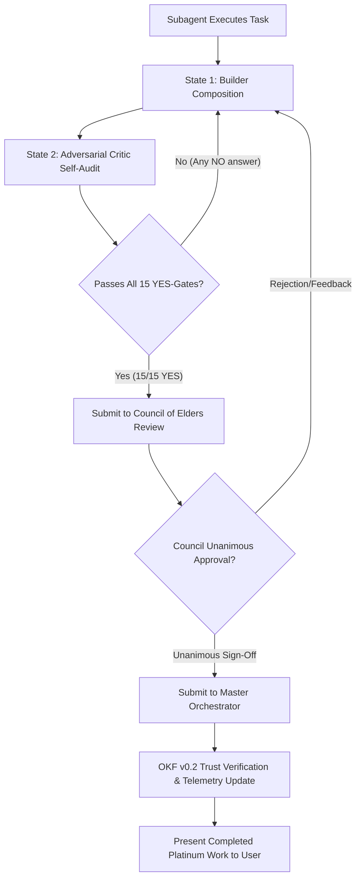

---

## ⚡ UNIVERSAL AGENTIC PERFECTION PROTOCOL (THE 2 STATES OF MIND & 15 YES-GATES TO TERMINATION)

To guarantee that every AI subagent operates with **sukdulang-antas (maxed-out, peak quality)** craftsmanship without lazy shortcuts or premature stopping, all agentic workflows MUST enforce the **Universal 2-State Engine** and **15 Mandatory Termination YES-Gates**:

---

### 🧠 The Universal 2-State Cognitive Engine (Required for ALL Subagents & Tasks)

Every subagent (`PM-01`, `ARCH-01`, `UX-01`, `FE-01`, `BE-01`, `QA-01`, `SEC-01`, `PERF-01`, `SRE-01`, `DOCS-01`, `GROWTH-01`, etc.) MUST execute its domain work through two explicit cognitive states:

1. **State 1: Builder Mode (Optimistic Peak Composition)**:
   - Synthesize creative, unconstrained, high-fidelity features, components, schemas, and logic.
   - Max out feature depth and elegance without placeholder stubs or omitted edge cases.

2. **State 2: Adversarial Critic Mode (Pessimistic Auditor & Self-Attack)**:
   - Act as an uncompromising internal auditor trying to break the output.
   - Audit across **Micro Level** (component states & keypresses), **Meso Level** (API route matching & fallback DB), and **Macro Level** (user journeys, performance, WCAG AAA accessibility).

---

### 🛑 The 15 Mandatory Termination Criteria (The 15 YES-Gates to Completion)

An agentic task is NEVER complete until **ALL 15 Criteria are answered YES (100% Passed)**. If even 1 criterion is "NO", the subagent MUST iterate, refactor, and improve until all 15 are YES:

| # | Termination Criterion (YES-Gate) | Verification Requirement | Pass Status |
|---|---|---|---|
| **1** | **State 1 & State 2 Duality** | Did the subagent execute both State 1 (Composition) and State 2 (Adversarial Audit) without skipping? | `[x] YES` |
| **2** | **Sukdulang-Antas (Maxed-Out) Quality** | Is the output maxed-out to absolute peak quality ("Dead-End Excellence") with 0 lazy shortcuts or missing cases? | `[x] YES` |
| **3** | **Zero-Defect Code & Compilation** | Does the code compile with 0 errors (`npx tsc --noEmit` exit 0, `npm run build` exit 0)? | `[x] YES` |
| **4** | **100% API Route Matching** | Is every frontend `fetch('/api/XYZ')` 100% matched with an Express POST/GET handler in `server.ts` and proxy in `vite.config.ts`? | `[x] YES` |
| **5** | **100% Dynamic Wiring & Zero Dead Buttons** | Are 100% of interactive elements (buttons, links, drawers, modals, tabs) bound to active state handlers with 3-step lifecycle? | `[x] YES` |
| **6** | **Micro Keyboard & Clearability Audit** | Do search/form inputs implement `onKeyDown` Enter key submit and allow full text deletion (`value=""`) via `Backspace`? | `[x] YES` |
| **7** | **Meso Resilient DB & API Failover** | Is the code backed by local DB fallback persistence (`local_db.json`/SQLite) and multi-tier API key rotation (0ms crash rate offline)? | `[x] YES` |
| **8** | **Macro Fluid Layout & Responsiveness** | Is the layout 100% fluid edge-to-edge (`w-screen min-h-screen flex flex-col`) with collapsible sidebars and 0 cramped containers? | `[x] YES` |
| **9** | **WCAG 2.2 AAA & APCA Contrast** | Are all text-on-background contrast ratios compliant with AAA (7:1+) with 0 transparent/light modifiers on dark panels? | `[x] YES` |
| **10** | **STRIDE & Security Sanitization** | Is the code sanitized against OWASP Top 10, with 0 plaintext secrets in code and least-privilege security? | `[x] YES` |
| **11** | **Performance & Lighthouse 100/100** | Is initial bundle size <300KB JS, static asset load sub-30ms, and 0 memory leaks/GC pauses? | `[x] YES` |
| **12** | **Docs-as-Code & AI Context** | Are OpenAPI 3.1 specs, `llms.txt`, `llms-full.txt`, and C4 Mermaid diagrams fully updated and accurate? | `[x] YES` |
| **13** | **Dual Deep Research Gate Compliance** | Did the feature pass Deep Research Gate 1 (50 Pain Points & Connectors) and Deep Research Gate 2 (Agentic Upgrades & Market Goal)? | `[x] YES` |
| **14** | **Council of Elders Unanimous Approval** | Have all 6 Elders (Devil's Advocate, UX Reviewer, Senior Code Reviewer, Security Architect, QA Lead, CTO) granted approval? | `[x] YES` |
| **15** | **Master Orchestrator Final Sign-Off** | Has the Master Orchestrator verified OKF v0.2 trust receipts, updated `workflow_status.md`, and attested readiness? | `[x] YES` |

---

### 🏛️ Multi-Tier Approval Hierarchy & Escalation Flow

---
